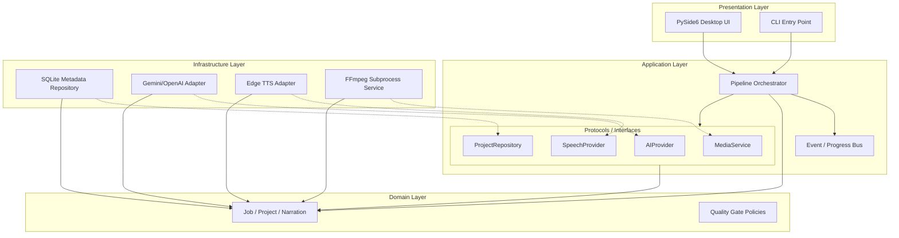

# Architecture Specification — VideoRecapStudio

Tài liệu này đặc tả chi tiết kiến trúc phần mềm, cấu trúc các tầng thành phần, ranh giới dịch vụ và cơ chế liên lạc giữa các tiến trình chạy nền và giao diện của **VideoRecapStudio**.

---

## 1. Kiến trúc phân tầng (Layered Architecture)

Hệ thống được thiết kế theo mô hình Clean Architecture (Ports & Adapters) chia làm 4 tầng logic độc lập:

1. **Domain Layer (`domain/`)**:
   - Chứa thực thể cốt lõi (`Job`, `Project`, `NarrationSegment`), quy tắc nghiệp vụ (Policies) và lỗi domain.
   - Hoàn toàn độc lập với các thư viện ngoài, cơ sở dữ liệu và giao diện.
2. **Application Layer (`application/`)**:
   - Chứa logic ca sử dụng (Use Cases - ví dụ: `OrchestratePipeline`, `EditNarration`).
   - Định nghĩa các cổng trừu tượng (Ports/Protocols) như `AIObservationProvider`, `SpeechProvider`, `ProjectRepository`.
3. **Infrastructure Layer (`infrastructure/`)**:
   - Triển khai (Implement) cụ thể các Protocols định nghĩa ở tầng Application (ví dụ: `SQLiteProjectRepository`, `GeminiObservationProvider`, `EdgeTtsSpeechProvider`, `FFmpegMediaService`).
   - Sử dụng các thư viện ngoài và thực thi CLI.
4. **Presentation Layer (`presentation/`)**:
   - Giao diện CLI và màn hình Desktop (PySide6).
   - Nhận dữ liệu đầu vào của người dùng, gọi Use Cases của tầng Application và hiển thị trạng thái qua mô hình Model-View-Presenter (hoặc MVC).

---

## 2. Sơ đồ Thành phần (Component Diagram)

Sơ đồ dưới đây mô tả cấu trúc thành phần và mối quan hệ phụ thuộc giữa các lớp:

---

## 3. Ranh giới Provider (Provider Boundaries)

Để tránh rò rỉ (leak) SDK của bên thứ ba vào ứng dụng, mọi Provider trong tầng Infrastructure bắt buộc phải:
- Không trả về các kiểu dữ liệu nội bộ của SDK (ví dụ: không trả về `google.generativeai.types.GenerateContentResponse`).
- Mọi dữ liệu trả về phải được chuyển đổi thành các Domain Models hoặc kiểu dữ liệu Python cơ bản (primitive types, Pydantic models).
- Xử lý lỗi cục bộ: Mọi exception sinh ra từ thư viện ngoài (như `openai.APIError` hay `httpx.HTTPError`) phải được bắt lại và ném ra dưới dạng các Exception được định nghĩa ở Domain Layer (ví dụ: `AIProviderError`).

---

## 4. Cơ chế Liên lạc & Event/Progress Bus

Để giữ giao diện PySide6 hoạt động mượt mà (không bị đơ/đóng băng) khi Pipeline đang chạy các tác vụ nặng (FFmpeg, API Calls) trên background threads, hệ thống sử dụng một **Event/Progress Bus**:

1. **Background Workers**:
   - Mỗi giai đoạn của Job (như `INGESTING`, `OBSERVING`) được thực thi trên một luồng nền riêng biệt (`QThread` hoặc `ThreadPoolExecutor`).
2. **Event Bus**:
   - Tầng Application định nghĩa một Event Bus trừu tượng. Presentation Layer đăng ký lắng nghe (Subscribe) thông qua cơ chế Signals/Slots của PySide6.
   - Khi Background Worker thực hiện xong một phần công việc, nó phát ra một sự kiện (ví dụ: `ProgressUpdated(stage, percentage, message)`).
   - UI đón nhận sự kiện này trên Main Thread một cách an toàn và cập nhật giao diện thời gian thực.
