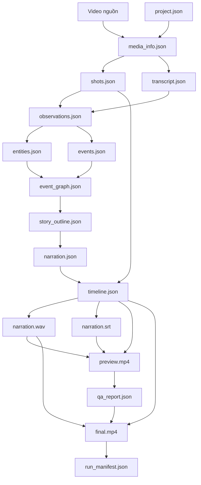

# Artifact Contract & Dependency Graph — VideoRecapStudio

Tài liệu này quy định hợp đồng định dạng (Schema Contract), quyền sở hữu (Ownership) của từng Giai đoạn và Đồ thị phụ thuộc (Dependency Graph) của 17 tệp Artifact bắt buộc trong hệ thống **VideoRecapStudio**.

---

## 1. Hợp đồng định dạng & Quyền sở hữu (Artifact Ownership)

Mỗi tệp Artifact được lưu trữ trong thư mục dự án và có cấu trúc JSON (được định nghĩa và kiểm định bằng Pydantic schemas) hoặc các định dạng media tiêu chuẩn (.mp4, .wav, .srt):

| Tên Tệp Artifact | Định dạng | Giai đoạn Sở hữu (Producer) | Mô tả & Ràng buộc nội dung (Schema Constraints) |
| :--- | :--- | :--- | :--- |
| `project.json` | JSON | `CREATED` | Chứa ID dự án, ngày tạo, đường dẫn video nguồn tuyệt đối, các presets và thông tin cấu hình. |
| `media_info.json` | JSON | `INGESTING` | Chứa metadata kỹ thuật của video nguồn (fps, width, height, codec, duration, bitrate). |
| `shots.json` | JSON | `DETECTING_SHOTS` | Mảng chứa danh sách các phân cảnh: `[{"shot_id": 1, "start_time": 0.0, "end_time": 4.5}]`. |
| `transcript.json` | JSON | `TRANSCRIBING` | Mảng lời thoại gốc trích xuất từ phụ đề hoặc STT: `[{"text": "...", "start": 0.0, "end": 4.5}]`. |
| `observations.json` | JSON | `OBSERVING` | Ghi nhận mô tả hình ảnh tĩnh tại keyframe và lời thoại tương ứng theo timestamp. **Nghiêm cấm chứa nội dung lời bình Narration.** |
| `entities.json` | JSON | `BUILDING_EVENTS` | Danh sách thực thể được phân loại (nhân vật, địa điểm) kèm định danh ID duy nhất sau khi giải quyết đồng nhất. |
| `events.json` | JSON | `BUILDING_EVENTS` | Các hành động/sự kiện ghép nối giữa Entities và Observations kèm timestamp nguồn và evidence refs. |
| `event_graph.json` | JSON | `BUILDING_EVENTS` | Đồ thị liên kết biểu thị các cạnh quan hệ: `source_event_id -> target_event_id` (loại quan hệ: nhân quả, trình tự). |
| `story_outline.json` | JSON | `PLANNING_STORY` | Bản tóm tắt dàn ý, bố cục recap chia làm các chương/phần (intro, body, outro) trích từ Event Graph. |
| `narration.json` | JSON | `WRITING_NARRATION` | Văn bản thuyết minh thuyết minh tiếng Việt: `[{"segment_id": 1, "text": "...", "evidence_refs": ["ev_01"]}]`. |
| `timeline.json` | JSON | `PLANNING_TIMELINE` | Bản vẽ dòng thời gian kết xuất, chỉ định file clip nào lấy từ video nguồn cắt ra (In/Out points) khớp với segment_id thoại nào. |
| `narration.wav` | WAV | `GENERATING_SPEECH` | File âm thanh thuyết minh chất lượng cao dạng PCM vô nén lồng ghép từ giọng TTS. |
| `narration.srt` | SRT | `GENERATING_SPEECH` | File phụ đề SRT đồng bộ hóa khớp thời lượng với tệp thoại thuyết minh thuyết minh `narration.wav`. |
| `preview.mp4` | MP4 | `RENDERING_PREVIEW` | Video kết xuất xem thử độ phân giải thấp, nén nhanh, gắn kèm phụ đề srt và audio thuyết minh trộn nhẹ. |
| `final.mp4` | MP4 | `RENDERING_FINAL` | Video thành phẩm chất lượng cao chuẩn HD/UHD hoàn tất kết xuất cuối cùng. |
| `qa_report.json` | JSON | `VALIDATING_PREVIEW`/`VALIDATING_FINAL` | Báo cáo kiểm định chất lượng: ghi nhận điểm số, các vi phạm chỉ số chất lượng và logs chi tiết. |
| `run_manifest.json` | JSON | `COMPLETED` | Bản khai lượt chạy chứa checksum của tất cả các file artifacts trên đĩa, hashes của các tệp đầu vào, ngày chạy và cost details. |

---

## 2. Đồ thị Phụ thuộc của Artifacts (Artifact Dependency Graph)

Đồ thị dưới đây chỉ ra thứ tự phụ thuộc dữ liệu logic giữa các Artifacts. Một Artifact chỉ có thể được tạo ra khi các Artifacts trỏ tới nó đã sẵn sàng:

