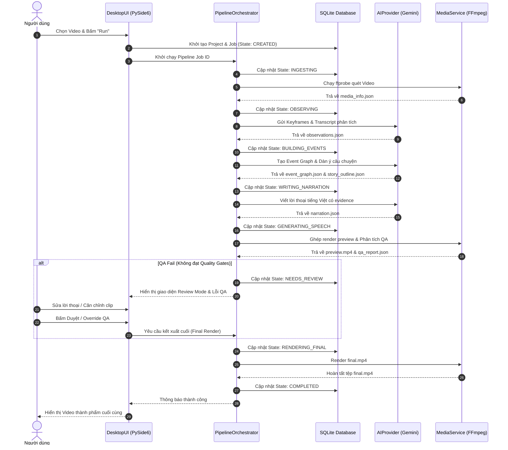

# Data Flow & Execution Pipeline — VideoRecapStudio

Tài liệu này mô tả chi tiết luồng di chuyển dữ liệu qua các giai đoạn (stages) của Pipeline và trình bày sơ đồ tuần tự (Sequence Diagram) từ đầu vào video nguồn đến kết quả đầu ra.

---

## 1. Bản đồ Dữ liệu Đầu vào & Đầu ra (Stage Inputs & Outputs)

Mỗi giai đoạn trong Pipeline nhận đầu vào từ các Artifacts đã được tạo ở các bước trước đó và ghi dữ liệu đầu ra thành một Artifact mới. Cơ chế này đảm bảo tính độc lập và khả năng khôi phục (Resume) từ điểm dừng lỗi:

| Giai đoạn (Stage) | Đầu vào (Inputs) | Đầu ra (Outputs) |
| :--- | :--- | :--- |
| **VALIDATING** | `project.json` | `run_manifest.json` (khởi tạo) |
| **INGESTING** | Video nguồn | `media_info.json`, `analysis_proxy.mp4` |
| **TRANSCRIBING** | `media_info.json` | `transcript.json` |
| **DETECTING_SHOTS**| `media_info.json` | `shots.json` |
| **OBSERVING** | `shots.json`, `transcript.json` | `observations.json` |
| **BUILDING_EVENTS**| `observations.json` | `entities.json`, `events.json`, `event_graph.json` |
| **PLANNING_STORY** | `event_graph.json` | `story_outline.json` |
| **WRITING_NARRATION**| `story_outline.json` | `narration.json` |
| **PLANNING_TIMELINE**| `narration.json`, `shots.json` | `timeline.json` |
| **GENERATING_SPEECH**| `timeline.json` | `narration.wav`, `narration.srt` |
| **RENDERING_PREVIEW**| `timeline.json`, `narration.wav` | `preview.mp4` |
| **VALIDATING_PREVIEW**| `preview.mp4` | `qa_report.json` (preview) |
| **NEEDS_REVIEW** | (Dừng để người dùng chỉnh sửa trên UI) | `narration.json` (sửa đổi), `timeline.json` (sửa đổi) |
| **RENDERING_FINAL** | `timeline.json`, `narration.wav` | `final.mp4` |
| **VALIDATING_FINAL** | `final.mp4` | `qa_report.json` (final), `run_manifest.json` (hoàn tất) |

---

## 2. Sơ đồ Tuần tự Đầu cuối (End-to-End Sequence Diagram)

Sơ đồ Mermaid dưới đây biểu diễn cách tương tác giữa người dùng, giao diện (DesktopUI), bộ điều phối (PipelineOrchestrator), các dịch vụ nền (Infrastructure Providers) và cơ sở dữ liệu SQLite:

