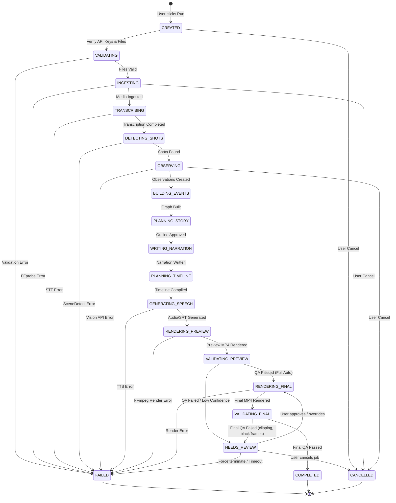

# Error Model & State Management — VideoRecapStudio

Tài liệu này đặc tả cơ chế quản lý lỗi, phân cấp lỗi (Error Taxonomy), chính sách thử lại (Retry Policy), quy trình hủy bỏ/khôi phục công việc (Cancellation/Resume) và sơ đồ chuyển đổi trạng thái (State Transition).

---

## 1. Phân cấp Lỗi & Sở hữu xử lý (Error Taxonomy & Ownership)

Hệ thống phân chia lỗi thành hai nhóm chính để áp dụng chính sách xử lý phù hợp:

1. **Lỗi tạm thời (Transient Errors)**:
   - **Mô tả**: Lỗi mạng, quá tải rate limit (HTTP 429), lỗi kết nối API tạm thời.
   - **Sở hữu (Owner)**: **Infrastructure Layer**.
   - **Chính sách**: Thực hiện thử lại tự động (Automatic Retry) sử dụng thuật toán Exponential Backoff kèm theo Jitter (nhiễu ngẫu nhiên) để tránh gây nghẽn hệ thống. Không ném lỗi này lên Application Layer trừ khi đã thử lại quá số lần cấu hình (ví dụ: tối đa 5 lần).
2. **Lỗi vĩnh viễn / Logic (Permanent/Logical Errors)**:
   - **Mô tả**: Sai thông tin xác thực (API Key không hợp lệ), lỗi dữ liệu đầu vào không đúng định dạng (Pydantic validation failed), hoặc lỗi phần cứng (hết bộ nhớ đĩa, FFmpeg vỡ code).
   - **Sở hữu (Owner)**: **Application Layer**.
   - **Chính sách**: Ngừng tiến trình lập tức, cập nhật trạng thái Job sang `FAILED` hoặc `NEEDS_REVIEW`, tạo log chi tiết lỗi và thông báo lên UI. Không thực hiện tự động thử lại cho lỗi vĩnh viễn.

---

## 2. Quy trình Hủy bỏ & Khôi phục (Cancellation & Resume)

### 2.1. Cơ chế Hủy bỏ (Cancellation)
- Khi người dùng bấm nút **"Cancel"** trên giao diện, Main Thread sẽ gửi tín hiệu hủy (qua đối tượng `CancellationToken` hoặc `threading.Event`).
- Các background workers trong Infrastructure Layer thực thi FFmpeg hoặc API Calls phải kiểm tra trạng thái tín hiệu này định kỳ (ví dụ: sau mỗi phân đoạn render).
- Khi phát hiện tín hiệu hủy, tiến trình con (subprocess) của FFmpeg sẽ bị chấm dứt (`kill()`), dọn dẹp các tệp tạm thời trên đĩa và cập nhật trạng thái Job thành `CANCELLED`.

### 2.2. Cơ chế Khôi phục (Resume/Skip)
- Khi một Job bị gián đoạn (do mất điện, crash hoặc bấm hủy) được khởi động lại:
  - Pipeline Orchestrator đọc `run_manifest.json` và kiểm tra thư mục `artifacts/`.
  - Đối với mỗi Stage, nó đối chiếu mã băm (hash) của file đầu vào hiện tại với hash ghi nhận trong manifest.
  - Nếu tệp Artifact đầu ra của Stage đó đã tồn tại, có checksum hợp lệ và hash đầu vào không đổi, hệ thống sẽ **bỏ qua (Skip)** giai đoạn đó và chuyển thẳng tới bước tiếp theo. Điều này giúp tiết kiệm tối đa chi phí gọi API AI và thời gian xử lý đa phương tiện.

---

## 3. Sơ đồ Chuyển đổi Trạng thái (State Transition Diagram)

Sơ đồ chuyển đổi trạng thái của một Job chạy qua Pipeline được định nghĩa như sau:

